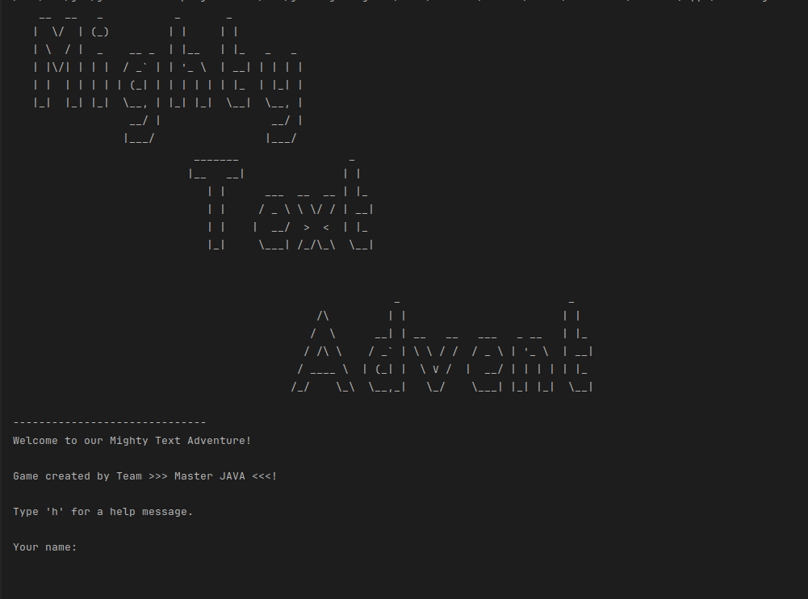

# basicJava_Mighty Text Adventure: [LIVE DEMO](https://replit.com/@shcoobz/basicJava-mighty-text-adventure)

## Summary

Mighty Text Adventure provides a thrilling text-based role-playing game experience set in a magical realm. It features classic RPG elements like exploration, combat, and story progression, all operated through a text-based console interface, aiming to evoke the nostalgia of early computer games.

The core functionality includes:

- Navigation through diverse magical areas via text commands.
- Engaging with a combat system that allows battles against various enemies.
- Managing an inventory that includes items like potions and magical wands.
- Making choices that influence the story's direction and outcomes.

## Features

### Exploration

Players can explore various areas, each uniquely described and filled with challenges and adventures.

### Combat System

A detailed combat system enables players to fight against a variety of enemies using strategies influenced by their current stats and inventory.

### Inventory Management

Handles items that players collect on their journey, such as potions for health recovery and a wand that enhances magical abilities.

### Story Progression

Interactive story elements that evolve based on the decisions and actions of the player, offering a dynamic gameplay experience.

## Technologies

- **Java**: Utilized as the core programming language for developing game logic and managing the user interface.
- **Scanner Class**: Employed for capturing and processing user input in the console environment.
- **Enum and Classes**: Used to systematically organize game elements like areas, enemies, and player attributes.

## Task Division

### [Adrian Monemi](https://github.com/AdrianMonemi):

- **Player Mechanics**: Implemented player attributes and item effects.
- **Game Logic**: Managed game progression, area exploration, and state transitions.
- **Battle Logic**: Developed strategies for combat and resource management.

### [Shcoobz](https://github.com/Shcoobz):

- **User Interface**: Crafted the text-based command system for player interaction.
- **Area Design**: Conceptualized and detailed the game's diverse areas.
- **Game Details**: Enhanced the game's narrative and interactive components.

---

_Note: This document provides an overview of Mighty Text Adventure. For detailed instructions and more information, please refer to the source code documentation._
